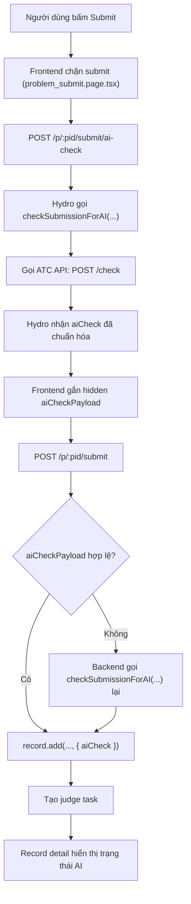

# README Nộp Đồ Án - Hydro

## 1. Mục tiêu tài liệu
Tài liệu này mô tả phần Hydro trong luồng submit bài có tích hợp AI check (gọi ATC API), gồm:
- Các thư mục/file quan trọng.
- Luồng xử lý từ frontend submit đến lưu `aiCheck` vào record.
- Luồng hiển thị kết quả AI check trên trang record.

## 2. Cấu trúc thư mục (phạm vi tích hợp AI check)

```text
Hydro-master/
|- package.json
|- build/
|- install/docker/judge/
`- packages/
   |- common/types.ts
   |- hydrooj/src/
   |  |- service/submissionAI.ts
   |  |- handler/problem.ts
   |  `- model/record.ts
   `- ui-default/
      |- templates/problem_submit.html
      |- pages/problem_submit.page.tsx
      `- templates/record_detail_status.html
```

### Root
- `package.json`:
  - `dev:judge:atc-ai`: chạy Hydro và set `HYDRO_SUBMISSION_AI_API_URL=http://127.0.0.1:19091/check`.
- `build/dev-all.js`: script dev chạy backend + frontend.

### `packages/common/`
- `types.ts`: định nghĩa `SubmissionAICheck`, `RecordPayload.aiCheck` (schema dữ liệu dùng chung).

### `packages/hydrooj/src/service/`
- `submissionAI.ts`:
  - `checkSubmissionForAI(input)`: hàm trung tâm.
  - Nếu có `HYDRO_SUBMISSION_AI_API_URL` -> gọi external API (`externalCheck`).
  - Nếu không có -> fallback local rule (`localFallbackCheck`).
  - Chuẩn hóa payload về format `SubmissionAICheck`.

### `packages/hydrooj/src/handler/`
- `problem.ts`:
  - Route `POST /p/:pid/submit/ai-check` (`ProblemSubmitAICheckHandler`): check AI trước submit.
  - Route `POST /p/:pid/submit` (`ProblemSubmitHandler`): submit chính thức.
  - `parseSubmissionAICheck(aiCheckPayload)`: parse kết quả AI check từ hidden input.
  - Nếu payload lỗi hoặc `state=error` thì backend gọi `checkSubmissionForAI()` lại để fallback an toàn.

### `packages/hydrooj/src/model/`
- `record.ts`:
  - `record.add(..., { aiCheck })`: lưu kết quả AI check vào document record.
  - Giữ nguyên luồng judge mặc định, chỉ bổ sung metadata `aiCheck`.

### `packages/ui-default/`
- `templates/problem_submit.html`: gán `UiContext.aiCheckUrl`, thêm form có `data-ai-check-form`.
- `pages/problem_submit.page.tsx`:
  - Chặn sự kiện submit.
  - Gọi `request.postFile(UiContext.aiCheckUrl, FormData(form))`.
  - Ghi kết quả vào hidden input `aiCheckPayload`.
  - Sau đó mới submit thật.
- `templates/record_detail_status.html`: hiển thị kết quả AI check (`Potential AI` / `Not AI` + `Score`).

### `install/docker/judge/`
- `entrypoint.sh`, `Dockerfile`: phần judge Docker; chờ backend sẵn sàng rồi mới khởi động judge.
- Judge không làm AI check trực tiếp, AI check xảy ra ở Hydro backend khi submit.

## 3. Sơ đồ luồng submit bài (end-to-end)



Sơ đồ chữ dự phòng:

```text
User -> Frontend submit form
Frontend -> /submit/ai-check -> Hydro -> ATC API /check
Hydro -> trả aiCheck -> Frontend gắn aiCheckPayload
Frontend -> /submit -> Hydro parse payload
Nếu payload lỗi -> Hydro check AI lại
Hydro -> record.add(aiCheck) -> judge queue -> trang record hiển thị AI check
```

## 4. Luồng dự phòng và tính ổn định
- Frontend AI check thất bại vẫn `submit anyway`; backend sẽ có cơ hội check lại.
- Nếu submit bằng file mà không có inline `code`, service có thể trả `state=skipped`.
- Nếu external API lỗi shape/HTTP/network, `submissionAI.ts` trả `state=error` có `message` rõ ràng.

## 5. Cách chạy trong môi trường đồ án

### Bước 1: chạy ATC API
```powershell
powershell -ExecutionPolicy Bypass -File C:\DATN\test\ATC_impl\start_atc_api.ps1
```

### Bước 2: chạy Hydro trỏ sang ATC
```powershell
cd C:\DATN\test\Hydro-master
corepack yarn dev:judge:atc-ai
```

### Bước 3: (nếu cần) chạy judge Docker local
```powershell
cd C:\DATN\test\Hydro-master\install\docker
docker compose -f docker-compose.local-judge.yml up -d
```

## 6. Định dạng dữ liệu `aiCheck` lưu trong record

```json
{
  "state": "checked",
  "isAI": false,
  "score": 0.1342,
  "provider": "atc-model",
  "message": "ATC score ...",
  "checkedAt": "2026-04-03T07:10:00.000Z"
}
```
